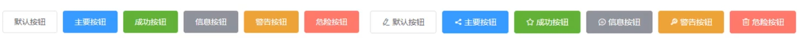

## 1 什么是Element

- Element: 是饿了么团队研发的，一套为开发者、设计师和产品经理准备的基于 Vue 2.0 的桌面端$\textcolor{red}{组件}$库。
- 组件: 组成网页的部件，例如 超链接、按钮、图片、表格、表单、分页条等等。
- 官网: https://element.eleme.cn/#/zh-CNListener

### 1.1 安装 ElementUl 组件库(在当前工程的目录下)，在命令行执行指令:

`npm install element-ui@2.15.3`

### 1.2 引入ElementUI组件库

```javascript
import ElementUI from 'element-ui';
import 'element-ui/lib/theme-chalk/index.css'

Vue .use(ElementUI);
```

### 1.3 访问官网，复制组件代码，调整



## 2 常见组件

### 2.1 表格

Table 表格: 用于展示多条结构类似的数据，可对数据进行排序、筛选、对比或其他自定义操作。

### 2.2 分页

Pagination 分页: 当数据量过多时，使用分页分解数据。

### 2.3 对话框

Dialog 对话框: 在保留当前页面状态的情况下，告知用户并承载相关操作。

### 2.4 表单

Form 表单: 由输入框、选择器、单选框、多选框等控件组成，用以收集、校验、提交数据。

