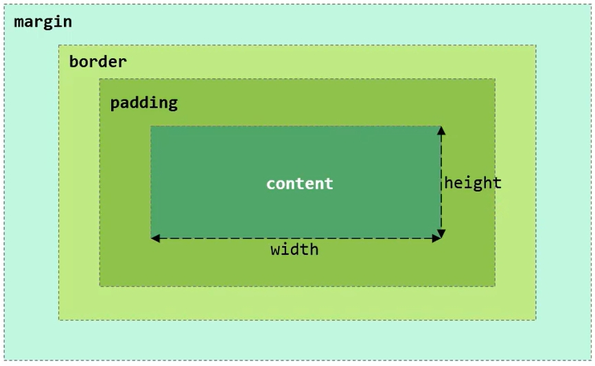

# 初识web前端

## web标准

- Web标准也称为网页标准，由一系列的标准组成，大部分由W3C (World Wide Web Consortium，万维网联盟) 负责制定。
- 三个组成部分:
  - HTML: 负责**网页的结构**(页面元素和内容)。
  - CSS: 负责**网页的表现**(页面元素的外观、位置等页面样式，如: 颜色、大小等)。
  - Javascript: 负责**网页的行为**(交互效果)。

# 什么是HTML、CSS？

## HTML

HTML (HyperTextMarkupLanguage): 超文本标记语言。

- 超文本: 超越了文本的限制，比普通文本更强大。除了文字信息，还可以定义图片、音频、视频等内容。

- 标记语言: 由标签构成的语言

  - HTML标签都是**预定义**好的。例如: 使用`<a>`展示超链接，使用``展示图片，`<video>`展示视频。
  - HTML代码直接在浏览器中运行，HTML标签由浏览器解析。

  标签搜索地址：https://www.w3schools.com/tags/default.asp

### 标题标签

- 标签：`<h1>...</h1>` (h1-> h6 重要程度依次降低)
- 注意：HTML 标签都是预定义好的，不能自己随意定义。

### 水平线标签 

`<hr>`

### 图片标签 

`` 

- 绝对路径：绝对磁盘路径 `D:/xxxx`,绝对网络路径 `https://xxxx`
- 相对路径：从当前文件开始查找。`./：当前目录，../：上级目录`

### `<span>` 标签

- 是一个在开发网页时大量会用到的没有语义的布局标签
- 特点: 一行可以显示多个(组合行内元素)，宽度和高度默认由内容撑开

### 视频标签

`<video>`

- src : 规定视频的 url
- controls : 显示播放控件
- width : 播放器的宽度
- height : 播放器的高度

### 音频标签

`<audio>`

- src : 规定音频的 url
- controls : 显示播放控件

### 段落标签

`<p>`

### 文本加粗标签

`<b> / <strong>`

### 表格标签

- 场景：在网页中以表格(行、列)形式整齐展示数据，如: 班级表。

- 标签：

  

### 表单标签

- 场景：在网页中主要负责数据采集功能，如 注册、登录等数据采集。

- 标签：`<form>`

  #### 表单项

  不同类型的 input 元素、下拉列表、文本域等。

  `<input>`: 定义表单项，通过type属性控制输入形式。

  

  `<select>`: 定义下拉列表。

  `<textarea>`: 定义文本域。

  

- 属性：
  `<action>`: 当提交表单时向何处发送表单数据，表单数据提交的URL地址。

  `<method>`: 发送表单数据的方式。

  - GET: 表单数据拼接在url后面，?username=java，**大小有限制。**

  - POST：表单数据在请求体中携带，**大小没有限制**。

- 注意：表单项必须有name属性才可以提交。

- HTML结构标签

  ```html
  <html>
  	<head>
  		<title>标题</title>
  	</head>
  	<body>
  	
  	</body>
  </html>
  ```

- 特点
  - HTML标签不区分大小写
  - HTML标签属性值单双引号都可以
  - HTML语法松散

- 注意

  - 在HTML中无论输入多少个空格，只会显示一个。可以使用空格占位符：`&nbsp`

例子：

***01.新浪新闻-标题-排版.html :***

```html
<!-- 文档类型为HTML -->
<!DOCTYPE html>
<html lang="en">
<head>
    <!-- 字符集为UTF-8 -->
    <meta charset="UTF-8">
    <!-- 设置浏览器的兼容性 -->
    <meta name="viewport" content="width=device-width, initial-scale=1.0">
    <title>焦点访谈：中国底气 新思想夯实大国粮仓</title>
</head>
<body>
    <!-- 
    img标签：
        src: 图片资源路径
        width: 宽度 (px,像素；%，相对于父元素的百分比)
        height: 高度 (px,像素；%，相对于父元素的百分比)
     路径书写方式：
        绝对路径：
            1.绝对磁盘路径：D:\Users\liuxu\HTML\img\news_logo.png
                
            2.绝对网络路径：https://i2.sinaimg.cn/dy/deco/2012/0613/yocc20120613img01/news_logo.png
                
        相对路径：
            ./：当前目录，./可以省略
                或 
            ../：上一级目录
        -->
     新浪政务 > 正文
    <h1>焦点访谈：中国底气 新思想夯实大国粮仓</h1>
    <hr>
    2023年03月02日 21:50 央视网
    <hr>
</body>
</html>
```

### 超链接

- 标签：`<a href="..." target="...">央视网</a>`
- 属性：
  - href : 指定资源访问的 url
  - target : 指定在何处打开资源链接
  - _self : 默认值，在**当前页面**打开
  - blank : 在新的**空白页面**打开

例子：

***04.新浪新闻-标题-超链接.html ：*** 

```html
<!DOCTYPE html>
<html lang="en">
<head>
    <meta charset="UTF-8">
    <meta name="viewport" content="width=device-width, initial-scale=1.0">
    <title>焦点访谈：中国底气 新思想夯实大国粮仓</title>
     <style>
        h1 {
                color: #4e4f53;
        }
        #time {
                color: #8a8a8a;
        }
        a {
                color:black;  
                text-decoration: none;  /* 设置文本为一个标准的文本 */
        }
     </style>
</head>
<body>
     <a href="https://gov.sina.com.cn/" target="_self">新浪政务</a> > 正文
    <h1>焦点访谈：中国底气 新思想夯实大国粮仓</h1>
    <hr>
    <span class="cls" id="time">2023年03月02日</span>    
    <span class="cls">21:50 <a href="https://news.cctv.com/2023/03/02/ARTIUCKFf9kE9eXgYE46ugx3230302.shtml" target="_blank">央视网</a></span>       
    <hr>
</body>
</html>
```

## CSS

CSS (Cascading Style Sheet): 层叠样式表，用于控制页面的样式(表现)。

### CSS 引入方式

- 行内样式: 写在标签的style属性中(不推荐)
- 内嵌样式: 写在style标签中(可以写在页面任何位置，但通常约定写在head标签中)
- 外联样式: 写在一个单独的.css文件中(需要通过 link标签在网页中引入)

### 颜色表示方式


例子：

***02.新浪新闻-标题-样式1.html :***

```html
<!DOCTYPE html>
<html lang="en">
<head>
    <meta charset="UTF-8">
    <meta name="viewport" content="width=device-width, initial-scale=1.0">
    <title>焦点访谈：中国底气 新思想夯实大国粮仓</title>
    <!-- 方式二：内嵌样式 -->
     <style>
        h1 {
                color: #4e4f53;
        }
     </style>
     <!-- 方式三：外联样式 -->
    <!-- <link rel="stylesheet" href="./css/news.css" -->
</head>
<body>
     新浪政务 > 正文
    <!-- 方式一：行内样式 -->
    <!-- <h1 style="color:rgb(77, 79, 83);">焦点访谈：中国底气 新思想夯实大国粮仓</h1> -->
    <h1>焦点访谈：中国底气 新思想夯实大国粮仓</h1>
    <hr>
    2023年03月02日 21:50 央视网
    <hr>
</body>
</html>
```

***new.css:***

```css
h1 {
    color: #4e4f53;
}
```

### CSS 选择器：用来选取需要设置样式的元素（标签）

三种选择器的优先级：id 选择器 > 类选择器 > 元素选择器

- 元素选择器

  

- id 选择器

  

- 类选择器

  

### CSS 属性

- color : 设置文本的颜色
- font-size : 字体大小 （注意：记得加 px）
- text-decoration : 规定添加到文本的修饰，none表示定义标准的文本。

### CSS 样式

- line-height : 设置行高
- text-indent : 定义第一个行内容的缩进
- text-align : 规定元素中的文本的水平对齐方式

例子：

***03.新浪新闻-标题-样式2.html ：***

```html
<!DOCTYPE html>
<html lang="en">
<head>
    <meta charset="UTF-8">
    <meta name="viewport" content="width=device-width, initial-scale=1.0">
    <title>焦点访谈：中国底气 新思想夯实大国粮仓</title>
     <style>
        h1 {
                color: #4e4f53;
        }
        /* 元素选择器 */
        /* span {
                color: #8a8a8a;
        } */
        /* 类选择器 */
        /* .cls {
                color: #8a8a8a;
        } */
        /* id 选择器 */
        #time {
                color: #8a8a8a;
                font-size: 13px; /* 设置字体大小 */
        }
     </style>
</head>
<body>
     新浪政务 > 正文
    <h1>焦点访谈：中国底气 新思想夯实大国粮仓</h1>
    <hr>
    <span class="cls" id="time">2023年03月02日</span>    
    <span class="cls">21:50 央视网</span>       
    <hr>
</body>
</html>
```

# 页面布局

- 盒子 : 页面中所有的元素(标签)，都可以看做是一个盒子，由盒子将页面中的元素包含在一个矩形区域内，通过盒子的视角更方便的进行页面布局。

- 盒子模型组成 : 内容区域(content)，内边距区域(padding)，边框区域(border)，外边距区域(margin)。

  

- 标签 : `<div> <span>`

- 特点 :

  - div 标签 :
    - 一行只显示一个(独占一行)
    - 宽度默认是父元素的宽度，高度默认由内容撑开
    - 可以设置宽高(width、height)

  - span 标签 :

    - 一行可以显示多个
    - 宽度和高度默认由内容撑开
    - 不可以设置宽高(width、height)

    > 注意 : 如果只需要设置某一个方位的边框、内边距、外边距，可以在属性名后加上 - 位置，如: padding-top、padding-left、padding-right .

例子：

***06.新浪新闻-正文-布局.html ：*** 

```html
<!DOCTYPE html>
<html lang="en">
<head>
    <meta charset="UTF-8">
    <meta name="viewport" content="width=device-width, initial-scale=1.0">
    <title>焦点访谈：中国底气 新思想夯实大国粮仓</title>
     <style>
        h1 {
                color: #4e4f53;
        }
        #time {
                color: #8a8a8a;
        }
        a {
                color:black;  
                text-decoration: none; 
        }
        p {
                text-indent: 35px; /* 设置首行缩进 */
                line-height: 40px; /* 设置行高 */
        }
        #plast{
                color: #8a8a8a;
                text-align: right;/* 对齐方式 */          
        }
        #center{
                width: 65%;
                /* margin: 0% 17.5% 0% 17.5%; */
                margin: 0 auto;
            }
     </style>
</head>
<body>
    <div id="center">
     <a href="https://gov.sina.com.cn/" target="_self">新浪政务</a> > 正文
    <h1>焦点访谈：中国底气 新思想夯实大国粮仓</h1>
    <hr>
    <span class="cls" id="time">2023年03月02日</span>    
    <span class="cls">21:50 <a href="https://news.cctv.com/2023/03/02/ARTIUCKFf9kE9eXgYE46ugx3230302.shtml" target="_blank">央视网</a></span>       
    <hr>
    <!-- 正文 -->
     <!-- 视频 -->
    <video src="video/news.mp4" controls width="950px"></video>
     <!-- 音频 -->
        <!-- <audio src="audio/news.m4a" controls ></audio> -->
    <p>
        <b>央视网消息</b>（焦点访谈）：党的十八大以来，以习近平同志为核心的党中央始终把解决粮食安全问题作为治国理政的头等大事，重农抓粮一系列政策举措有力有效，我国粮食产量站稳1.3万亿斤台阶，实现谷物基本自给、口粮绝对安全。我们把饭碗牢牢端在自己手中，为保障经济社会发展提供了坚实支撑，为应对各种风险挑战赢得了主动。连续八年1.3万亿斤，这个沉甸甸的数据是如何取得的呢？
    </p>
    <p>
        人勤春来早，春耕农事忙。立春之后，由南到北，我国春耕春管工作陆续展开，春天的田野处处生机盎然。
    </p>
    
    <p>
        今年，我国启动了新一轮千亿斤粮食产能提升行动，这是一个新的起点。2015年以来，我国粮食产量连续8年稳定在1.3万亿斤以上，人均粮食占有量始终稳稳高于国际公认的400公斤粮食安全线。从十年前的约12200亿斤到2022年的约13700亿斤，粮食产量提高了1500亿斤。
    </p>
    
    <p>
        国务院发展研究中心农村经济研究部部长叶兴庆：“我们研究粮食安全的人有一个概念，1000亿斤是一个台阶，这就是说我们用十年时间使粮食产量上了一个半台阶。这是在化肥和农药开始减量的情况下取得的，是在极端天气事件多发、频发的情况下取得的，是在从事农业生产的人口减少的条件下取得的，这在中国粮食生产发展历史中是一个了不起的成就。”
    </p>
    <p>
        国家仓廪充实，为经济社会行稳致远夯实了根基。14亿人口要吃饭，这是中国最大的国情。党的十八大以来，习近平总书记四次出席中央农村工作会议并发表重要讲话，对“三农”工作和粮食生产、粮食安全作出一系列重要指示。2013年12月召开的中央农村工作会议上，习近平总书记把“确保我国粮食安全”放在首位。
    </p>
    
    <p>
        叶兴庆：“早在2013年，习近平总书记就明确提出来要确保谷物基本自给，口粮绝对安全，要实现这样一个目标，总书记又提出新的粮食安全战略，就是那五句话20个字，‘以我为主，立足国内，确保产能，适度进口，科技支撑’。”
    </p>
    <p id="plast">
        责任编辑：王树淼 SN242
    </p>
    </div>
</body>
</html>
```

***07.HTML-表单项标签.html :***

```html
<!DOCTYPE html>
<html lang="en">
<head>
    <meta charset="UTF-8">
    <meta name="viewport" content="width=device-width, initial-scale=1.0">
    <title>HTML-表单</title>
</head>
<body>
    <form action="" method="post">
        姓名：<input type="text" name="name"><br><br>
        密码：<input type="password" name="password"><br><br>
        性别：<label><input type="radio" name="gender" value="1">男</label>
              <label><input type="radio" name="gender" value="2">女</label><br><br>
        爱好：<label><input type="checkbox" name="hobby" value="java">java</label>
              <label><input type="checkbox" name="hobby" value="game">game</label>
              <label><input type="checkbox" name="hobby" value="sing">sing</label><br><br>
        图像：<input type="file" name="image"><br><br>
        生日：<input type="date" name="birthday"><br><br>
        日期时间：<input type="datetime-local" name="datetime"><br><br>
        邮箱：<input type="email" name="email"><br><br>
        年龄：<input type="text" name="age"><br><br>
        学历：<select name="degree">
            <option value="">-----------请选择--------</option>
            <option value="1">大专</option>
            <option value="2">本科</option>
            <option value="3">硕士</option>
            <option value="4">博士</option>
        </select><br><br>
        描述：<textarea name="description" cols="30" rows="10"></textarea><br><br>
        <input type="hidden" name="id" value="1">
        <!-- 表单常见按钮 -->
        <input type="button" value="按钮">
        <input type="reset" value="重置">
        <input type="submit" value="提交">
        <br>
    </form>
</body>
</html> 
```

