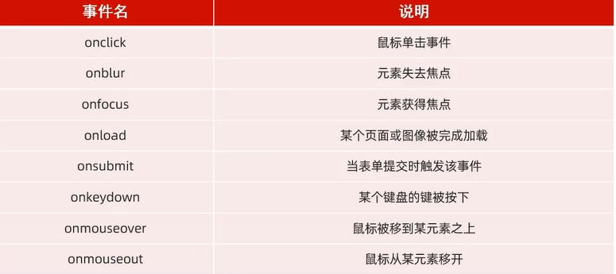

# 什么是 JavaScript?


- JavaScript (简称: JS) 是一门跨平台、面向对象的脚本语言 (**脚本语言**是不需要编译，直接通过浏览器的解释就可以运行)。是用来控制网页行为的，它能使网页可交互。
- JavaScript 和 Java 是完全不同的语言，不论是概念还是设计。但是基础语法类似。
- JavaScript 在1995 年由 Brendan Eich 发明，并于1997 年成为 ECMA 标准。
- ECMAScript6(ES6) 是最新的 JavaScript 版本(发布于2015年)。

# 一、JS 引入方式

## **1. 内部脚本**

 将 JS 代码定义在 HTML 页面中。

- JavaScript 代码必须位于`<script></script>`标签之间。

- 在HTML文档中，可以在任意地方，放置任意数量的`<script>`。

- 一般会把脚本置于`<body>`元素的底部，可改善显示速度。

  ```html
  <script>
  	alert("Hello javaScript")
  </script>
  ```

## **2. 外部脚本** 

将 JS 代码定义在外部 JS 文件中，然后引入到 HTML 页面中。

- 外部 JS 文件中，只包含 JS 代码，不包含`<script>`标签。

- `<script>` 标签不能自闭合。

  上述例子更改为：

  ```javascript
  <script src= "js/demo.js"></script>
  ```

  ```javascript
  alert("Hello javaScript")
  ```

  

# 二、JS 基础语法

## **1. 书写语法**

- 区分大小写: 与 Java 一样，变量名、函数名以及其他一切东西都是区分大小写的。
- 每行结尾的分号可有可无
- 注释:
  单行注释: `// 注释内容`
  多行注释: `/* 注释内容 */` 
- 大括号表示代码块

## **2. 输出语句**

- 使用 `window.alert()` 写入警告框
- 使用 `document.write()` 写入 HTML 输出
- 使用 `console.log()` 写入浏览器控制台

## **3. 变量**

- JavaScript 中用 **var 关键字** (variable 的缩写) 来声明变量。

- JavaScript 是一门弱类型语言，变量可以存放不同类型的值。

  - 特点1：var 作用于比较大，是全局变量。

    （**let 是局部变量，不能重复定义**）(**const 是常量，不能被改变**)

  - 特点2：**var 可以重复定义**的，后面定义的会把前面定义的覆盖。

  ```javascript
  var a = 20;
  
  a = "张三";
  ```

- 变量名需要遵循如下规则：

  - 组成字符可以是任何字母、数字、下划线 (_) 或美元符号 ($)
  - 数字不能开头
  - 建议使用驼峰命名

## **4. 数据类型、运算符、流程控制语句**

- 数据类型：JavaScript 中分为**原始类型**和**引用类型**，使用 typeof 运算符可以获取数据类型。

  (1) 原始类型

  - number : 数字(整数、小数、NaN(NotaNumber))

  - string : 字符串，单双引皆可

  - boolean : 布尔。true，false

  - null : 对象为空。

    > 为什么 typeof 运算符对于 nul 值会返回"Object"。
    >
    > 这实际上是 javaScript 最初实现中的一个错误，然后被 ECMAScript 沿用了。现在，null 被认为是对象的占位符，从而解释了这一矛盾，但从技术上来说，它仍然是原始值。

  - undefined : 当声明的变量未初始化时，该变量的默认值是undefined

  （2）引用类型

- 运算符

  - 算术运算符: `+，-，*，/，%，++，--`

  - 赋值运算符: `=，+=，-=，*=，/=，%=`

  - 比较运算符: `>，<，>=，<=，!=，==，===`

    > == 会进行类型转换。
    >
    > === 不会进行类型转换。

  - 逻辑运算符: `&&，||，!`

  - 三元运算符: `条件表达式 ? true value : false valu`e

- 类型转换

  - 字符串类型转为数字
    - `parseInt` 将字符串字面值转为数字。如果字面值不是数字，则转为NaN。
  - 其他类型转为 boolean:
    - Number: **0** 和 **NaN** 为**false**，其他均转为 true。
    - String: **空字符串**为 **false**，其他均转为 true。
    - **Null 和 undefined**: 均转为 false。

- 流程控制语句

  [参考官方文档](https://www.w3school.com.cn/jsref/jsref_statements.asp)

  - if...else if ...else...
  - switch
  - for
  - while
  - do ... while

# 三、JS 函数

## 1. 介绍

函数(方法)是被设计为执行特定任务的代码块。

## 2. 定义

JavaScript 函数通过 function 关键字进行定义，语法为:

定义方式一：

```javascript
function functionName(参数1,参数2..){
    //要执行的代码
}
```

定义方式二：

```javascript
var functionName =function(参数1,参数2..){
	//要执行的代码
}
```

## 3. 注意

- 形式参数不需要类型。因为JavaScript是弱类型语言
- 返回值也不需要定义类型，可以在函数内部直接使用return返回即可

## 4. 调用

函数名称(实际参数列表)

# 四、JS 对象

## 1. JS基础对象

- Array 对象用于定义数组

  javaScript 中的数组相当于Java 中集合，数组的**长度是可变的**，而 JavaScript 是弱类型，所以**可以存储任意的类型的数据**。

  - 定义：
    - 方式一：`var 变量名 = new Array(元素列表);`
    - 方式二：`var 变量名 = [元素列表];`

  - 访问：

    - `arr[索引] = 值;`

  - 属性：

    - length 设置或返回数组中元素的数量。

  - 方法：

    - forEach() **遍历**数组中的**每个有值的元素**，并调用一次传入的函数。

      **箭头函数(ES6): **是用来简化函数定义语法的。

      具体形式为: `(...) => {...}`，如果需要给箭头函数起名字: `var xxx = (...) => {...}`

    - push() 将**新元素添加到数组的末尾**，并返回新的长度。

    - splice() 从数组中**删除元素**。

- String

  - 定义：
    - 方式一：`var 变量名=new String("…");`
    - 方式二：`var 变量名="...";`

  - 属性：
    - length 字符串的长度。
  - 方法：
    - charAt() 返回在指定位置的字符。
    - indexOf() 检索字符串。
    - trim() 去除字符串两边的空格。
    - substring() 提取字符串中两个指定的索引号之间的字符。（**含头不含尾**）

- 自定义对象

  - 定义：

    ```javascript
    var 对象名 = {
    	属性名1:属性值1,
    	属性名2:属性值2,
    	属性名3:属性值3，
    	函数名称:function(形参列表){}
    	//或者 函数名称(形参列表){}
    };
    ```

  - 调用：

    `对象名.属性名;`
    `对象名.函数名();` 

- JSON

  概念: javaScript Object Notation，javaScript 对象标记法。JSON 是通过 JavaScript 对象标记法书写的**文本**。

  - 定义：`var 变量名 = '{"key1" : value1, "key2" : value2 }';`
  - JSON 字符串转为 JS 对象
    `var jsObject = JSON.parse(userStr);`
  - JS 对象转为 JSON 字符串
    `var jsonStr = JSON.stringify(jsObject);`

## 2. BOM对象

概念: Browser Object Model 浏览器对象模型，允许 JavaScript 与浏览器对话，JavaScript 将浏览器的各个组成部分封装为对象。

- Window: 浏览器窗口对象

  - 获取：直接使用window，其中 window.可以省略。

    `window.alert("Hello window");`或`alert("Hello window");`

  - 属性：

    (1) history: 对 History 对象的只读引用。

    (2) location: 用于窗口或框架的 Location 对象。

    (3) navigator: 对 Navigator对象的只读引用。

  - 方法：

    (1) alert(): 显示带有一段消息和一个确认按钮的警告框。

    (2) confirm(): 显示带有一段消息以及确认按钮和取消按钮的对话框。如果是确认返回值是true，如果是取消返回值是false。

    (3) setlnterval(): 按照指定的周期(以毫秒计)来调用函数或计算表达式。

    (4) setTimeout(): 在指定的毫秒数后调用函数或计算表达式。延迟指定时间执行一次。

- Location: 地址栏对象
  - 获取：`window.location.属性;` 或 `location.属性;`
  - 属性：href: 设置或返回完整的URL。`location.href = "https://www.itcast.cn";`

## 3. DOM对象

概念: Document Object Model，文档对象模型。

**将标记语言的各个组成部分封装为对应的对象:**

- Document: 整个文档对象
  - 根据id属性值获取，返回单个Element对象
    `var h1 = document.getElementById('h1');`
  - 根据标签名称获取，返回Element对象数组
    `var divs = document.getElementsByTagName('div');`
  - 根据name属性值获取，返回Element对象数组
    `var hobbys = document.getElementsByName('hobby');`
  - 根据class属性值获取，返回Element对象数组
    `var class = document.getElementsByClassName('cls');`
- Element: 元素对象
- Attribute: 属性对象
- Text: 文本对象
- Comment: 注释对象

**JavaScript 通过 DOM，就能够对 HTML 进行操作:**

- 改变 HTML 元素的内容
- 改变 HTML 元素的样式(CSS)
- 对 HTML DOM 事件作出反应
- 添加和删除 HTML 元素

# 五、JS 事件监听

事件: HTML事件是发生在HTML元素上的“事情”。比如:

- 按钮被点击
- 鼠标移动到元素上
- 按下键盘按键

事件监听: JavaScript可以在事件被侦测到时 执行代码。

## 1. 事件绑定

方式一: 通过 HTML 标签中的事件属性进行绑定

```javascript
<input type="button" onclick="on()" value="按钮1">
<script>
    function on(){
    	alert('我被点击了!);
    }
</script>
```

方式二：通过 DOM 元素属性绑定

```javascript
<input type="button" id="btn" value="按钮2">
<script>
document.getElementById('btn').onclick=function(){
    alert('我被点击了!);
    }
</script>
```

## 2. 常见事件



