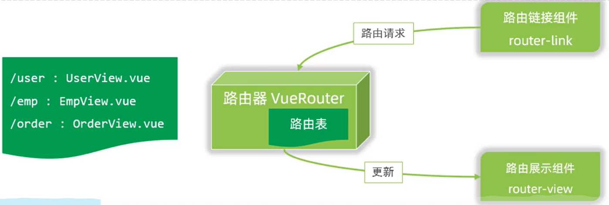
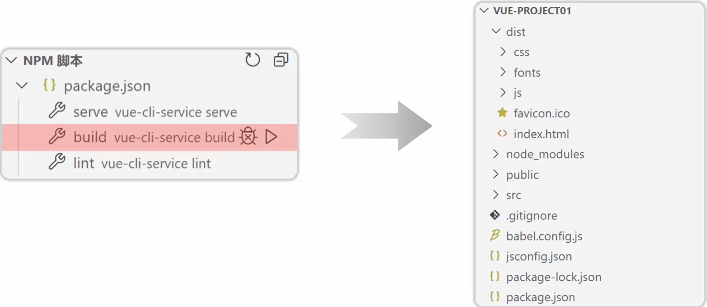

**前端路由：** URL 中的 hash(#号) 与组件之间的对应关系。

## 1. Vue 路由

### 1.1 Vue Router

- 介绍: Vue Router 是 Vue 的官方路由。

- 组成:

  - VueRouter: 路由器类，根据路由请求在路由视图中动态渲染选中的组件。

    

  - `<router-link>`：请求链接组件，浏览器会解析成`<a>`。

    ```javascript
    <router-link to="/emp">员工管理</router-link>
    ```

  - `<router-view>` ：动态视图组件，用来渲染展示与路由路径对应的组件。

    ```javascript
    <router-view></router-view>
    ```

- 安装(创建Vue项目时已选择) 

  - ```javascript
    npm install vue-router@3.5.1
    ```

- 定义路由

## 2. 打包部署

### 2.1 打包



### 2.2 部署

**Nginx**
介绍：Nginx 是一款轻量级的 Web 服务器 / 反向代理服务器及电子邮件 (IMAP/POP3) 代理服务器。其特点是占有内存少，并发能力强，在各大型互联网公司都有非常广泛的使用。

官网：https://nginx.org/

- 部署：将打包好的 dist 目录下的文件，复制到 Nginx 安装目录的 html 目录下。
- 启动：双击 nginx.exe 文件即可，Nginx 服务器默认占用 80 端口号

**注意：**Nginx 默认占用80端口号，如果80端口号被占用，可以在nginx.conf 中修改端口号。(netstat -ano | findstr 80)