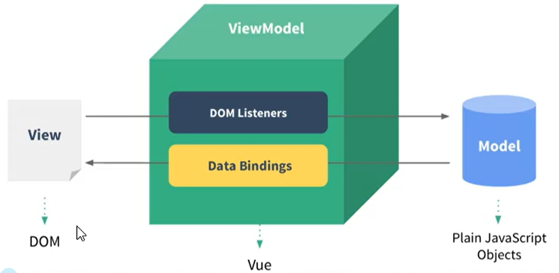
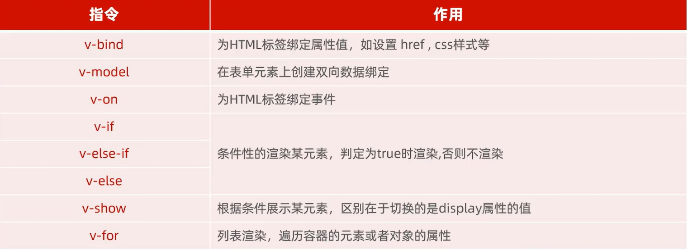
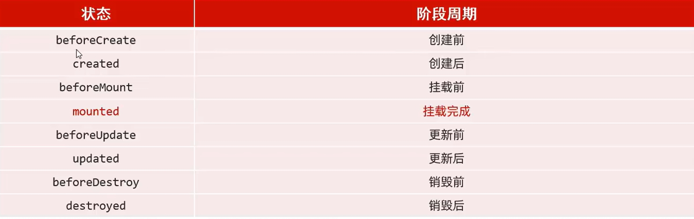
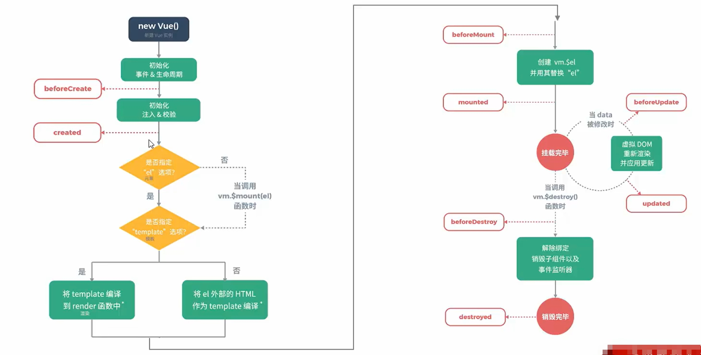

# 什么是 Vue ？

- Vue 是一套**前端框架**，免除原生 JavaScript中的 DOM 操作，简化书写。（***框架:*** 是一个半成品软件，是一套可重用的、通用的、软件基础代码模型。基于框架进行开发，更加快捷、更加高效。）

- 基于 **MVVM**(Model-View-ViewModel) 思想，实现数据的**双向绑定**，将编程的关注点放在数据上。

- 官网: https://v2.cn.vuejs.org/

  MVVM结构：



## 1. Vue 快速入门

- 新建HTML页面，引入Vue.js文件。`<script src="js/vue.js"></script>`

- 在JS代码区域，创建Vue核心对象，定义数据模型。

  ```javascript
  <script>
  	new Vue({
      	el:"#app", //vue接管的区域
      	data:{
  			message:"Hello Vue!"
          }
  })
  </script>
  ```

- 编写视图。

  ```javascript
  <div id="app">
      <input type="text" v-model="message">
          {{ message }}
  </div>
  ```

  - 插值表达式

    形式： `{{表达式}}`。

    内容：

    - 变量
    - 三元运算符
    - 函数调用
    - 算数运算

    

## 2. Vue 常用指令

- 指令：HTML 标签上带有 v- 前缀 的特殊属性，不同指令具有不同含义。例如:v-if，v-for...

- 常用指令：

  

  - v-bind: `<a v-bind:href="url">传智教育</a>`或 `<a :href="url">传智教育</a>`

  - v-model: `<input type="text" v-model="url">`

    通过v-bind或者v-model绑定的变量，必须在数据模型中声明。

  - v-on: `<input type="button" value="按钮" v-on:click="handle()">`或 `<input type="button" value="按钮" @click="handle()">`

    ```javascript
    <script>
        new vue({
        	el:"#app",
        	data:{
                //...
            },
    	methods:{
            handle:function(){
                alert('我被点击了');
            }
        },
    })
    </script>
    ```

  - v-if: 

    ```javascript
    年龄{{age}},经判定为:
    <span v-if="age<= 35">年轻人</span>
    <span v-else-if="age >35 && age< 60">中年人</span>
    <span v-else>老年人</span>
    ```

  - v-show: 

    ```javascript
    年龄{{age}},经判定为:
    <span v-show="age<= 35">年轻人</span>
    ```

  - v-for: `<div v-for="addr in addrs">{{addr}}</div>` 或 `<div v-for="(addr,index)in addrs">{{index + 1}} : {{addr}}</div>` 

    ```javascript
    data:{
        ...
        addrs:['北京'，'上海'，'广州','深圳'，'成都'，'杭州']
    },
    ```

## 3. Vue 生命周期

- 生命周期: 指一个对象从创建到销毁的整个过程

- 生命周期的八个阶段: 每触发一个生命周期事件，会自动执行一个生命周期方法(钩子)。

  

  

  - mounted: 挂载完成，Vue 初始化成功，HTML 页面渲染成功。(发送请求到服务端，加载数据)

    ```javascript
    <script>
    	new vue({
        el:"#app",data:{
    	}，
        mounted(){
        	console.log("Vue挂载完毕,发送请求获取数据");
    	}，
        methods:{
        },
    })
    </script>
    ```

    