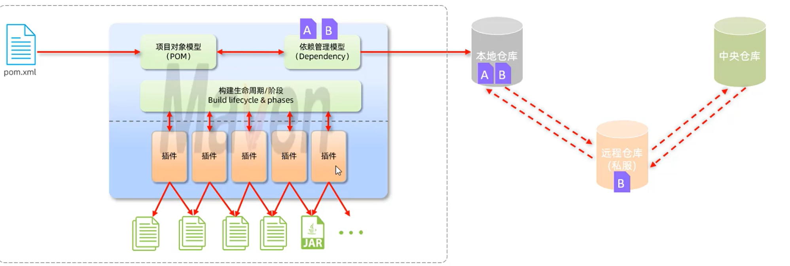
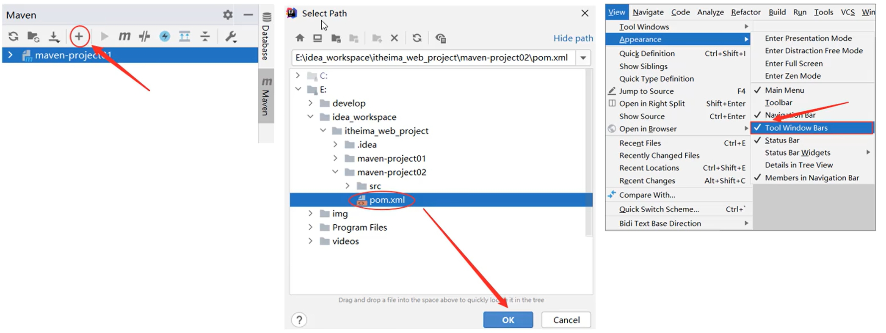
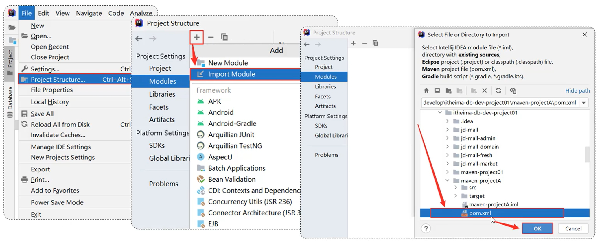
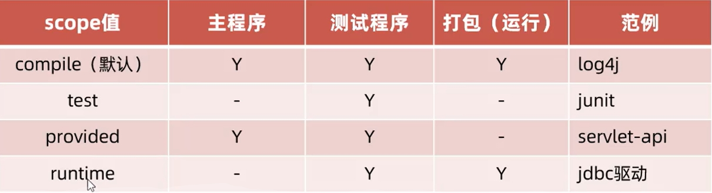

# 一、Maven 介绍

## 1. 什么是 Maven 

Maven 是 apache 旗下的一个开源项目，是一款用于管理和构建java项目的工具。它基于项目对象模型(POM)的概念，通过一小段描述信息来管理项目的构建。

## 2. Maven 的作用

 ### 2.1 依赖管理

方便快捷的管理项目依赖的资源 (jar包)，避免版本冲突问题。
### 2.2 统一项目结构

提供标准、统一的项目结构。
### 2.3 项目构建

标准跨平台 (Linux、Windows、MacOs) 的自动化项目构建方式。

## 3. 官网

http://maven.apache.org/

## 4. Maven模型



**仓库：** 用于存储资源，管理各种jar包。

- **本地仓库：** 自己计算机上的一个目录。
- **中央仓库：** 由Maven团队维护的全球唯一的。仓库地址：https://repo1.maven.org/maven2/ 
- **远程仓库(私服)：** 一般由公司团队搭建的私有仓库。

## 5. 安装

1. 解压 apache-maven-3.6.1-bin.zip 。

2. 配置本地仓库： 修改 conf/settings.xml中的`<localRepository>`为一个指定目录。

   ```javascript
   <localRepository>E:\develop\apache-maven-3.6.1\mvn repo</localRepository>
   ```

3. 配置阿里云私服：修改 conf/settings.xml中的`<mirrors>`标签，为其添加如下子标签:

   ```javascript
   <mirror>
   	<id>alimaven</id>
   	<name>aliyun maven</name>	 <url>http://maven.aliyun.com/nexus/content/groups/public/</url>
       <mirrorOf>central</mirrorOf>
   </mirror>
   ```

4. 配置环境变量：MAVEN HOME为maven的解压目录，并将其bin目录加入PATH环境变量。

# 二、IDEA集成Maven

## 1. 配置Maven环境

- 选择IDEA中 File -->Settings --> Build, Execution, Deployment --> Build Tools --> Maven。
- 设置 IDEA 使用本地安装的 Maven，并修改配置文件及本地仓库路径。

 ## 2. 创建Maven项目

## 2.1 步骤

- 创建模块，选择Maven，点击Next
- 填写模块名称，坐标信息，点击finish，创建完成
- 编写 HelloWorld，并运行

## 2.2 Maven坐标

- 什么是坐标?
  - Maven 中的坐标是资源的唯一标识，通过该坐标可以唯一定位资源位置。
  - 使用坐标来定义项目或引入项目中需要的依赖。
- Maven 坐标主要组成
  - groupld：定义当前Maven项目隶属组织名称(通常是域名反写，例如:com.itheima)
  - artifactld：定义当前Maven项目名称(通常是模块名称，例如 order-service、goods-service)
  - version：定义当前项目版本号

## 3. 导入Maven项目

- **方式一：** 打开IDEA，选择右侧Maven面板，点击+号，选中对应项目的pom.xml文件，双击即可。



- **方式二：** 打开IDEA，选择右侧Maven面板，点击+号，选中对应项目的pom.xml文件，双击即可



# 三、依赖管理

## 3.1 依赖配置

- 依赖：指当前项目运行所需要的jar包，一个项目中可以引入多个依赖。

- 配置：

  1. 在 pom.xml中编写`<dependencies>`标签

  2. 在`<dependencies>`标签中 使用`<dependency>`引入坐标

  3. 定义坐标的 groupld，artifactld，version

  4. 点击刷新按钮，引入最新加入的坐标

     注意：

     - 如果引入的依赖，在本地仓库不存在，将会连接远程仓库/中央仓库，然后下载依赖。(这个过程会比较耗时，耐心等待)
     - 如果不知道依赖的坐标信息，可以到https://mvnrepository.com/中搜索。

## 3.2 依赖传递

- 依赖具有传递性

  **直接依赖：** 在当前项目中通过依赖配置建立的依赖关系。

  **间接依赖：** 被依赖的资源如果依赖其他资源，当前项目间接依赖其他资源

- 排除依赖

  **排除依赖：** 主动断开依赖的资源，被排除的资源无需指定版本。

## 3.3 依赖范围

依赖的jar包，默认情况下，可以在任何地方使用。可以通过 `<scope>...</scope>` 设置其作用范围。

**作用范围：**

- 主程序范围有效。(main文件夹范围内)
- 测试程序范围有效。(test文件夹范围内)
- 是否参与打包运行。(package指令范围内)

**scope 的取值：**



## 3.4 生命周期

Maven的生命周期就是为了对所有的maven项目构建过程进行抽象和统一。

- **Maven中有==3套==相互独立的生命周期:**

  - **clean：** 清理工作。
    - clean：移除上一次构建生成的文件。
  - **default：** 核心工作，如:编译、测试、打包、安装、部署等。
    - compile：编译项目源代码。
    - test：使用合适的单元测试框架运行测试(junit)。
    - package：将编译后的文件打包，如:jar、war等。
    - install：安装项目到本地仓库。

  - **site：** 生成报告、发布站点等。

    **注意：**在**同一套**生命周期中，当运行后面的阶段时，前面的阶段都会运行。

- **执行指定生命周期的两种方式：**
  - 在idea中，右侧的maven工具栏，选中对应的生命周期，双击执行。
  - 在命令行中，通过命令执行。