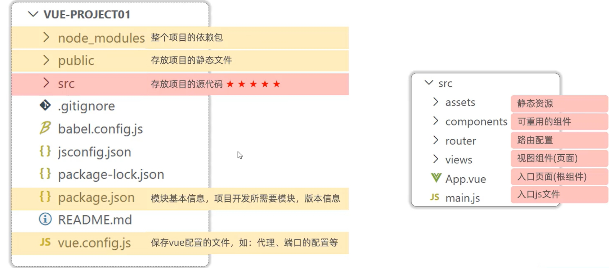
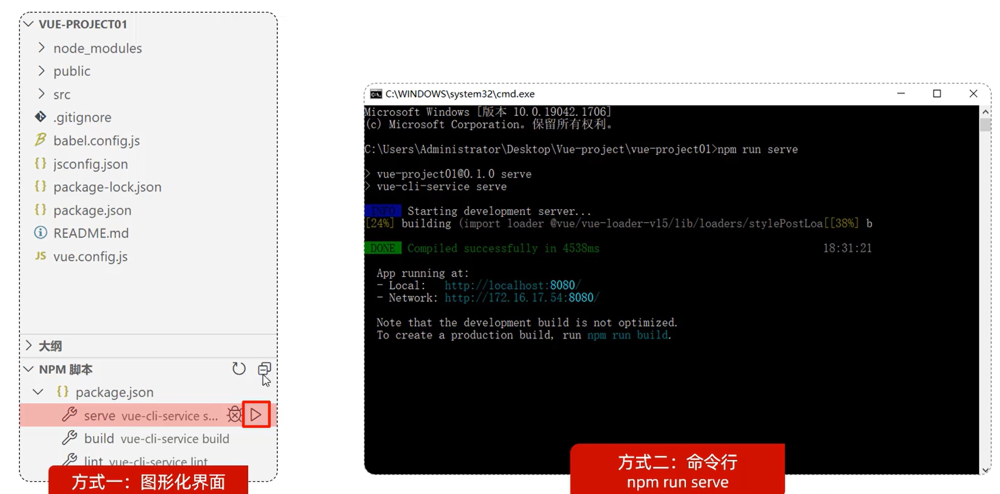
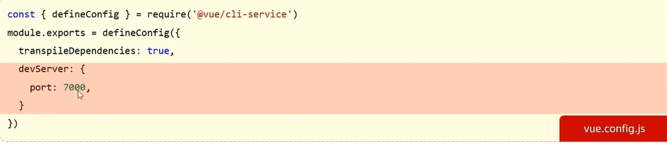
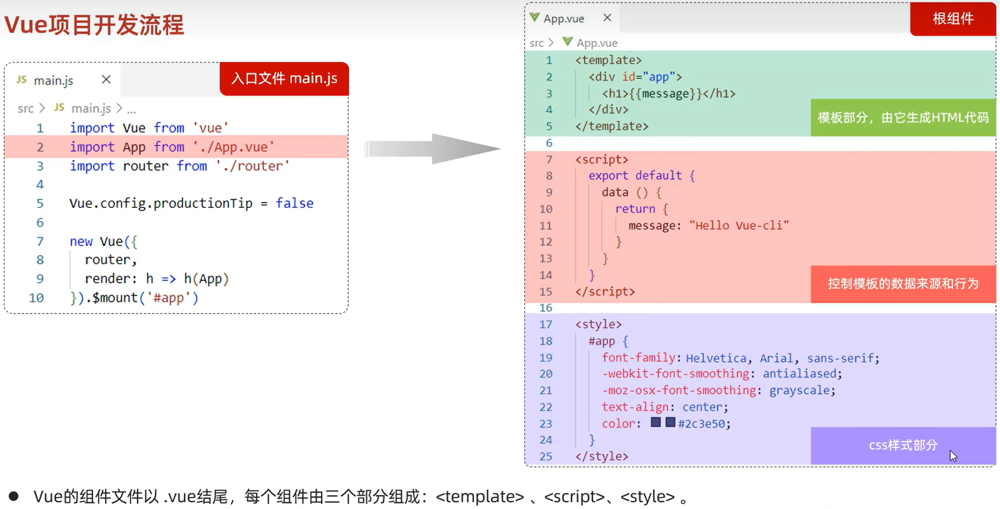

# 前端工程化

前端工程化: 是指在企业级的前端项目开发中，把前端开发所需的工具技术、流程、经验等进行规范化、标准化。

## YApi

YApi 是高效、易用、功能强大的 api  管理平台，旨在为开发、产品、测试人员提供更优雅的接口管理服务。

- 添加项目
- 添加分类
- 添加接口

# 环境准备

## vue-cli

1. 介绍: Vue-cli 是Vue官方提供的一个脚手架，用于快速生成一个 Vue 的项目模板。
2. Vue-cli 提供了如下功能：
   - 统一的目录结构
   - 本地调试
   - 热部署(修改后不需要重新启动项目，也不需要刷新浏览器)
   - 单元测试
   - 集成打包上线
3. 依赖环境：NodeJS

# Vue项目简介

1. 命令行: `vue create vue-project01`

2. 图形化界面: `vue ui`

   基于Vue脚手架创建出来的工程，有标准的目录结构，如下：

   

3. Vue 项目启动

   

4. Vue 项目配置端口

   

# Vue项目开发流程

 

